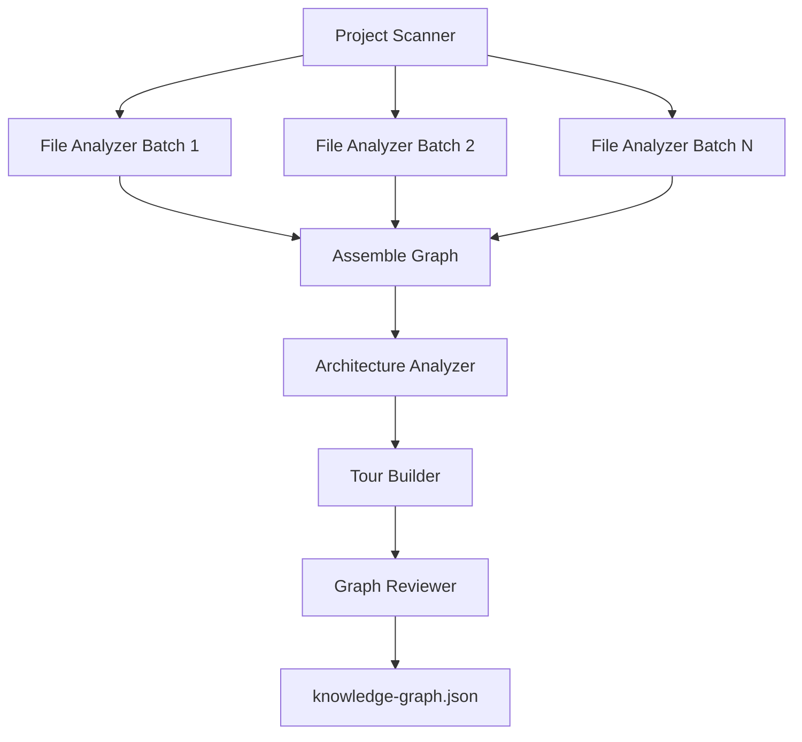

# Q1 — Why use five sequential agents instead of a single monolithic agent?

<!-- *   **Project Name:** Understand-Anything
*   **Repository:** [https://github.com/Lum1104/Understand-Anything](https://github.com/Lum1104/Understand-Anything)
*   **Project Category:** AI Developer Tools / Code Understanding Platform
*   **Deadline:** April 3rd, 2026 -->

## 1. Project Overview and Key Components

### Repository Analysis Summary

This question examines why Understand-Anything implements `/understand` as a staged five-agent pipeline instead of handing the entire repository-understanding task to one large monolithic agent. The answer depends on how the repo separates scanning, file extraction, graph assembly, architecture reasoning, onboarding generation, and validation.

Within the Understand-Anything codebase, this question primarily touches the following areas:

- `understand-anything-plugin/skills/understand/SKILL.md`
- `README.md`
- `CLAUDE.md`

## 2. Deep Reasoning Questions & Analysis

## Expanded overview

> [!NOTE]
> Understand-Anything is trying to solve a large-scale code understanding problem, not a one-shot summarization problem. That means the system needs to discover the repository, analyze many files, produce a graph, infer architecture, generate tours, and validate the final output. Those are different reasoning tasks with different data shapes and different failure modes. The repo therefore splits them into specialized stages rather than asking one agent to do everything in one pass.


## Why this matters

> [!IMPORTANT]
> **Key Context**
> - Large repositories create context pressure and prompt bloat.
> - Some stages require raw files, while others only need graph-level abstractions.
> - Validation should be independent from generation.
> - Incremental updates become much easier when the work is decomposed into reusable phases.


## Detailed answer

### Short answer

> [!TIP]
> Understand-Anything uses five sequential agents because each phase needs different context, different output constraints, and different reasoning behavior. A monolithic agent would be harder to scale, harder to validate, and harder to reuse incrementally.


### Why the staged pipeline fits this repo

- **Project scanner** finds files, languages, frameworks, and import hints.
- **File analyzer** works on batch-level structural and semantic extraction.
- **Architecture analyzer** reasons over the assembled graph instead of raw source.
- **Tour builder** reasons pedagogically over README, entry points, layers, and graph flow.
- **Graph reviewer** checks the assembled graph as a QA layer instead of generating content.

### Why not a monolithic agent?

A single giant prompt would have to carry repository inventory, raw code, architecture reasoning, pedagogy, and validation instructions all at once. That would blur responsibilities and make failures harder to isolate. By contrast, the staged pipeline lets each phase consume exactly the abstraction level it needs.

### Parallelism inside the sequential design

The repo is not purely serial. The file-analysis stage is explicitly parallelized into batches of 20-30 files with up to five concurrent subagents. That means the top-level flow stays deterministic, while the most expensive stage still scales efficiently.

## Flow Diagram



## Code Snippet

```text
Phase 1 — SCAN
Phase 2 — ANALYZE
  - 20-30 files per batch
  - up to 5 subagents concurrently
Phase 3 — ASSEMBLE
Phase 4 — ARCHITECTURE
Phase 5 — TOUR
Phase 6 — REVIEW
```

### Code citation(s)

| File Referenced | Repository Link |
|---|---|
| `understand-anything-plugin/skills/understand/SKILL.md` | [View File](https://github.com/Lum1104/Understand-Anything/blob/main/understand-anything-plugin/skills/understand/SKILL.md) |
| `README.md` | [View File](https://github.com/Lum1104/Understand-Anything/blob/main/README.md) |
| `CLAUDE.md` | [View File](https://github.com/Lum1104/Understand-Anything/blob/main/CLAUDE.md) |


### How the evidence was stitched together

This answer was derived by examining the orchestration pipeline defined in `SKILL.md` where the pipeline steps are explicitly laid out. The `README.md` and `CLAUDE.md` documents also describe the project's strategy to break the reasoning down into batch processes and specific sub-tasks rather than a single massive context prompt.

## Practical design implications

| ✨ Design Implication | Description |
|---|---|
| **Impact 1** | The system can re-run only the changed-file analysis in incremental mode. |
| **Impact 2** | Failures are easier to localize because each phase has a clear contract. |
| **Impact 3** | Later stages do not need raw source code again if the graph is already built. |
| **Impact 4** | Validation can act as an independent quality gate. |


## Conclusion

Overall, Q1 highlights a deliberate architectural choice in Understand-Anything: the system prefers staged, specialized reasoning over a monolithic all-in-one prompt because that approach is easier to scale, validate, and reuse.

## Architectural reasoning

The pipeline is structured so that each phase consumes the smallest useful abstraction from the previous one. That reduces prompt complexity, improves fault isolation, and makes incremental updates feasible. In other words, sequencing is not overhead here; it is what keeps the system operationally reliable as repositories grow.

## Trade-offs and limitations

> [!WARNING]
> **Considerations**
> - More orchestration complexity than a single-agent design.
> - More intermediate artifacts and normalization logic to manage.
> - More prompt templates to maintain.
> - The payoff is stronger scalability, better fault isolation, and cleaner reasoning boundaries.


## Example scenario

Suppose a repository has 180 files and only 6 changed since the last analysis. In the current staged design, Understand-Anything can re-run file analysis for those changed files, rebuild the merged graph, then regenerate layers and tours from the updated graph. A monolithic agent would tend to re-read and re-reason over the whole repository again.

## Source files referenced

- `understand-anything-plugin/skills/understand/SKILL.md`
- `README.md`
- `CLAUDE.md`

## 3. Findings and Conclusion

The analysis of Q1 shows that the five-agent pipeline is an architectural scaling decision, not just a prompt-writing preference. Understand-Anything decomposes repository understanding into stages because those stages operate on different kinds of evidence and should fail independently.

In practical terms, this makes the system more reliable, more incremental, and easier to validate than a monolithic agent approach. The design choice strengthens Understand-Anything as a reusable code-intelligence system rather than a one-shot code summarizer.
