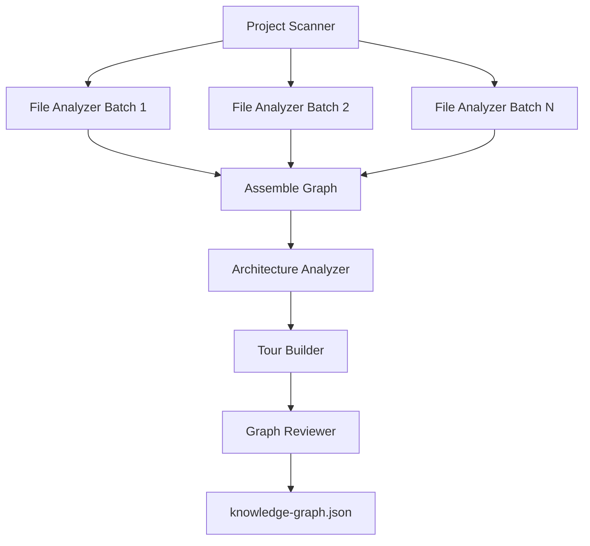

# Q1 README

## Question

Why use five sequential agents instead of a single monolithic agent?

## Answer

Understand-Anything uses five sequential agents because each stage of codebase understanding needs a different abstraction level and output format. The project scanner reasons about repository inventory and frameworks. The file analyzer reasons about source-level structure and semantics. The architecture analyzer reasons over the assembled graph. The tour builder reasons pedagogically. The graph reviewer reasons adversarially and validates correctness. Putting all of that inside one monolithic agent would mix incompatible responsibilities into one oversized prompt and one fragile output contract.

The sequence also matches the repo's real dependencies. Layer detection only makes sense after nodes and edges exist. Tour generation becomes stronger after layers and entry points are known. Validation only becomes meaningful after the graph is assembled. This is why `understand-anything-plugin/skills/understand/SKILL.md` is written as an explicit phased pipeline instead of one giant agent run.

Another key point is that the system is only sequential where order matters. The expensive file-analysis stage is parallelized in batches of 20-30 files, with up to five concurrent subagents. So the architecture keeps deterministic top-level flow while still scaling the heaviest stage.

This design also enables incremental updates. When files change, the tool can re-run file analysis only for the changed files, merge the results, and then rebuild higher-level artifacts like layers and tours. A monolithic agent would make that reuse much harder.

## Flow Diagram



## Pipeline Snippet

```text
Phase 1 — SCAN
Phase 2 — ANALYZE
  - 20-30 files per batch
  - up to 5 subagents concurrently
Phase 3 — ASSEMBLE
Phase 4 — ARCHITECTURE
Phase 5 — TOUR
Phase 6 — REVIEW
```

## Key Repo Evidence

- `understand-anything-plugin/skills/understand/SKILL.md`
- `README.md`
- `CLAUDE.md`
