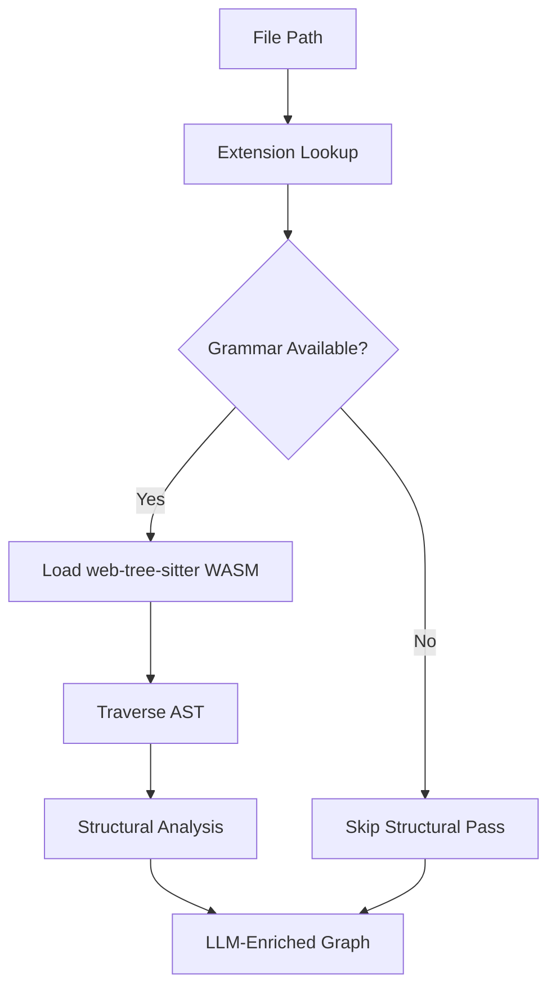

# Q2 README

## Question

Why use tree-sitter instead of language-specific AST parsers like Python's `ast` module?

## Answer

Understand-Anything is designed to analyze many kinds of repositories, not just Python projects. A parser like Python's `ast` works well for one language, but this repo is built around a shared TypeScript core that needs a consistent structural-analysis layer across languages. Tree-sitter provides that common interface.

In `understand-anything-plugin/packages/core/src/plugins/tree-sitter-plugin.ts`, the system maps file extensions to language grammars, loads grammars lazily, and extracts functions, classes, and imports through one plugin abstraction. That gives the core engine a unified way to enrich the graph across TypeScript, JavaScript, and future language additions without building a different orchestration path for each language parser.

The repo also makes a portability-focused choice by using `web-tree-sitter`. `CLAUDE.md` explicitly notes that native `tree-sitter` bindings were problematic on darwin/arm64 with Node 24. Using a WASM-based runtime keeps the tool easier to run across supported agent platforms and local environments.

Another major advantage is graceful degradation. The design docs make it clear that the LLM is still the primary analyzer and structural analysis is an enhancement. If a grammar is missing, the file can still be analyzed semantically. That is a cleaner fallback model than maintaining many separate language-specific AST backends with different runtime requirements.

## Flow Diagram



## Code Snippet

```ts
private languageKeyFromPath(filePath: string): string | null {
  const ext = extname(filePath).toLowerCase();

  // Special case: .tsx needs its own grammar
  if (ext === ".tsx") return "tsx";

  return this._extensionToLang.get(ext) ?? null;
}
```

## Key Repo Evidence

- `understand-anything-plugin/packages/core/src/plugins/tree-sitter-plugin.ts`
- `understand-anything-plugin/packages/core/src/languages/configs/`
- `docs/plans/2026-03-21-language-agnostic-design.md`
- `CLAUDE.md`
