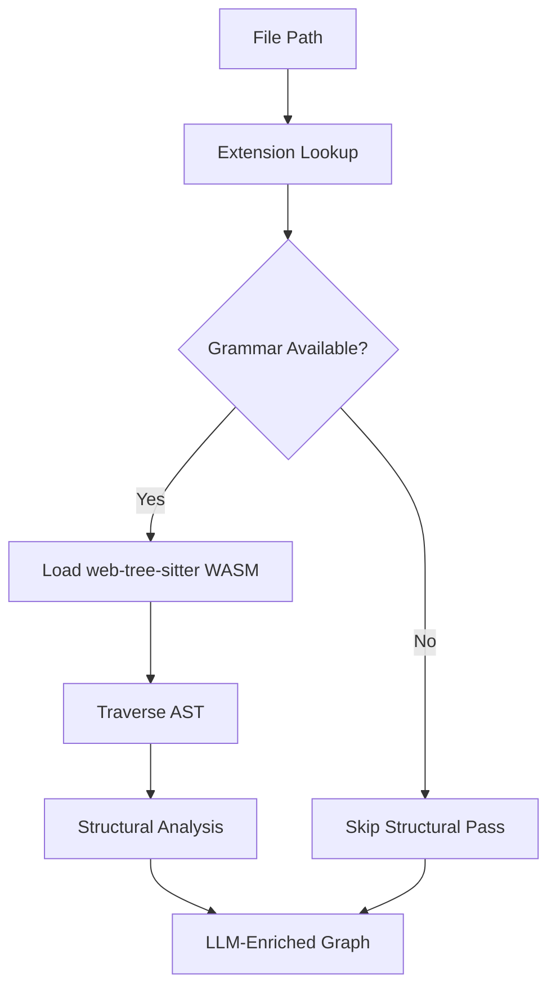

# Q2 — Why use tree-sitter instead of language-specific AST parsers like Python's `ast` module?

<!-- *   **Project Name:** Understand-Anything
*   **Repository:** [https://github.com/Lum1104/Understand-Anything](https://github.com/Lum1104/Understand-Anything)
*   **Project Category:** AI Developer Tools / Code Understanding Platform
*   **Deadline:** April 3rd, 2026 -->

## 1. Project Overview and Key Components

### Repository Analysis Summary

This question examines why Understand-Anything uses a tree-sitter-based structural analysis layer instead of relying on language-specific parser APIs such as Python's built-in `ast` module. The answer is tied to the repository's language-agnostic design and its need for a shared parsing strategy inside a TypeScript core.

Within the Understand-Anything codebase, this question primarily touches the following areas:

- `understand-anything-plugin/packages/core/src/plugins/tree-sitter-plugin.ts`
- `understand-anything-plugin/packages/core/src/languages/configs/`
- `docs/plans/2026-03-21-language-agnostic-design.md`
- `CLAUDE.md`

## 2. Deep Reasoning Questions & Analysis

## Expanded overview

> [!NOTE]
> Understand-Anything is not a Python-only tool. It is trying to analyze mixed-language repositories and produce one common graph artifact. That means its structural-analysis subsystem has to be portable, configurable, and consistent across languages. Tree-sitter fits that need better than a collection of unrelated language-specific AST APIs.


## Why this matters

> [!IMPORTANT]
> **Key Context**
> - The project supports multiple languages and frameworks.
> - A shared TypeScript core needs one consistent plugin interface.
> - Platform portability matters across local setups and agent ecosystems.
> - Structural analysis must fail gracefully without breaking the full pipeline.


## Detailed answer

### Short answer

> [!TIP]
> Tree-sitter gives Understand-Anything a unified structural-analysis layer across languages, whereas language-specific parsers like Python's `ast` solve only one slice of the overall problem.


### Why tree-sitter fits this repo

- The plugin maps file extensions to language grammars.
- Grammars are loaded lazily and cached.
- Extraction logic is driven through one analyzer abstraction.
- Unsupported grammars can be skipped gracefully while the LLM still analyzes the file semantically.

### Why not use separate native AST APIs?

If the project used Python's `ast`, Go's parser, Java parsers, and others independently, the core would need different runtime dependencies, integration strategies, and failure handling logic for each language. That would make the system more fragmented and harder to distribute.

### Portability reason visible in the repo

`CLAUDE.md` explicitly notes that the project uses `web-tree-sitter` rather than native `tree-sitter` because native bindings caused problems on darwin/arm64 with Node 24. So this is not only about parsing expressiveness; it is also about making the tool portable in real environments.

## Flow Diagram



## Code Snippet

```ts
private languageKeyFromPath(filePath: string): string | null {
  const ext = extname(filePath).toLowerCase();

  // Special case: .tsx needs its own grammar
  if (ext === ".tsx") return "tsx";

  return this._extensionToLang.get(ext) ?? null;
}
```

### Code citation(s)

| File Referenced | Repository Link |
|---|---|
| `understand-anything-plugin/packages/core/src/plugins/tree-sitter-plugin.ts` | [View File](https://github.com/Lum1104/Understand-Anything/blob/main/understand-anything-plugin/packages/core/src/plugins/tree-sitter-plugin.ts) |
| `understand-anything-plugin/packages/core/src/languages/configs/` | [View File](https://github.com/Lum1104/Understand-Anything/blob/main/understand-anything-plugin/packages/core/src/languages/configs/) |
| `docs/plans/2026-03-21-language-agnostic-design.md` | [View File](https://github.com/Lum1104/Understand-Anything/blob/main/docs/plans/2026-03-21-language-agnostic-design.md) |
| `CLAUDE.md` | [View File](https://github.com/Lum1104/Understand-Anything/blob/main/CLAUDE.md) |


### How the evidence was stitched together

To answer this, I looked closely at the `tree-sitter-plugin.ts` inside the `packages/core` directory. The codebase structure reveals an explicit avoidance of single-language APIs to favor `web-tree-sitter`, as further reinforced by the `2026-03-21-language-agnostic-design.md` plan and the WASM considerations mentioned in `CLAUDE.md`.

## Practical design implications

| ✨ Design Implication | Description |
|---|---|
| **Impact 1** | Structural extraction can be reused across many languages. |
| **Impact 2** | The core package stays centered around one plugin model. |
| **Impact 3** | Missing grammar support degrades gracefully instead of crashing analysis. |
| **Impact 4** | The system is easier to ship across supported agent environments. |


## Conclusion

Overall, Q2 highlights a deliberate architectural choice in Understand-Anything: the project favors a single portable parsing strategy that can support many languages consistently instead of tying the core to one language ecosystem.

## Architectural reasoning

Tree-sitter gives the repo a common structural-analysis interface while keeping semantic understanding delegated to the LLM layer. That combination matches the project's broader goal of language-agnostic codebase understanding: consistent structure extraction where possible, graceful fallback where necessary.

## Trade-offs and limitations

> [!WARNING]
> **Considerations**
> - Grammar loading and WASM handling add complexity.
> - Language support depends on available tree-sitter grammars.
> - Deep semantic understanding still requires the LLM layer.
> - The benefit is a far more coherent multi-language architecture.


## Example scenario

If a repository mixes TypeScript, JavaScript, YAML, Markdown, and Python, a tree-sitter-centered approach gives the analysis engine one structural pipeline and one registry model. A language-specific-parser approach would require the system to coordinate many different parser ecosystems separately.

## Source files referenced

- `understand-anything-plugin/packages/core/src/plugins/tree-sitter-plugin.ts`
- `understand-anything-plugin/packages/core/src/languages/configs/`
- `docs/plans/2026-03-21-language-agnostic-design.md`
- `CLAUDE.md`

## 3. Findings and Conclusion

The analysis of Q2 shows that tree-sitter is a strategic architecture choice for portability and language-agnostic structure extraction. Understand-Anything is designed around one shared core, and tree-sitter gives that core a much cleaner multi-language parsing story than a patchwork of language-specific AST APIs would.

In practice, this choice keeps the system extensible, more portable, and better aligned with the repo's goal of understanding arbitrary codebases rather than one language family.
