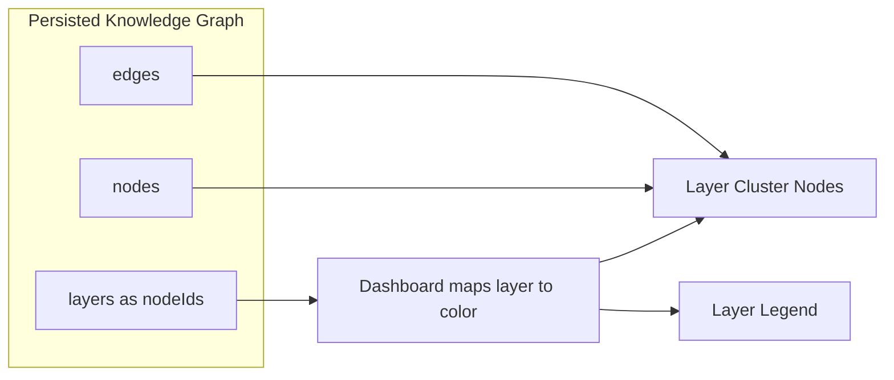

# Q3 — Why encode layer information as visual attributes (color) rather than explicit graph nodes?

## 1. Project Overview and Key Components

### Repository Analysis Summary

This question examines why Understand-Anything keeps architectural layers outside the primary node set and instead renders them as a visualization lens in the dashboard. The answer depends on the repo's distinction between semantic graph structure and UI-level grouping.

Within the Understand-Anything codebase, this question primarily touches the following areas:

- `docs/plans/2026-03-14-understand-anything-design.md`
- `understand-anything-plugin/packages/dashboard/src/components/LayerLegend.tsx`
- `understand-anything-plugin/packages/dashboard/src/components/GraphView.tsx`
- `understand-anything-plugin/packages/dashboard/src/utils/edgeAggregation.ts`

## 2. Deep Reasoning Questions & Analysis

## Expanded Overview

Architectural layers in Understand-Anything are not treated as ordinary code entities. A layer is a grouping of existing node IDs, not a new type of semantic object that participates in code dependencies. That distinction is important because layers describe one way of looking at the graph, not an additional class of domain object that the graph itself must model as a dependency endpoint.

## Why This Matters

- The graph should represent real code relationships, not synthetic presentation edges.
- Layer grouping should improve readability without distorting topology.
- Search, aggregation, and tour logic should remain grounded in actual repository structure.
- The dashboard needs a strong architecture lens without polluting persisted semantics.

## Detailed Answer

### Short answer

Understand-Anything encodes layers as metadata plus color/grouping in the dashboard because layers are architectural classifications, not real dependency nodes.

### What would go wrong with explicit layer nodes?

If the system created a graph node for each layer and linked many files to it, those layer nodes would become artificial hubs. The graph would then mix real dependencies with UI-only membership links. That would distort edge density, change path structure, and make the graph less truthful as a representation of code relationships.

### How the repo handles layers instead

- The persisted graph stores layers separately as `id`, `name`, `description`, and `nodeIds`.
- `LayerLegend.tsx` assigns visual colors to layer identities.
- `GraphView.tsx` derives overview cluster nodes from `graph.layers`.
- `edgeAggregation.ts` computes cross-layer relationships by aggregating actual edges between member nodes.

### Important nuance

The dashboard does create temporary React Flow layer cluster nodes, but those are presentation-level objects only. They are derived from the graph for display and are not written back as semantic graph nodes.

## Diagram



## Code Snippet

```ts
export const LAYER_PALETTE = [
  { bg: "rgba(74, 124, 155, 0.12)", border: "rgba(74, 124, 155, 0.4)", label: "#4a7c9b" },
  { bg: "rgba(90, 158, 111, 0.12)", border: "rgba(90, 158, 111, 0.4)", label: "#5a9e6f" },
  { bg: "rgba(139, 111, 176, 0.12)", border: "rgba(139, 111, 176, 0.4)", label: "#8b6fb0" },
];
```

## Practical Design Implications

- The persisted graph stays semantically cleaner.
- The dashboard can provide architecture grouping without corrupting dependency meaning.
- Cross-layer summaries are derived from actual edges, not invented ones.
- The same graph artifact remains reusable for search, tours, and explain flows.

## Conclusion

Overall, Q3 highlights a deliberate architectural choice in Understand-Anything: architectural layers are treated as an interpretive lens over the graph rather than as synthetic dependency objects inside the graph itself.

## Architectural Reasoning

The repository separates semantic truth from visual organization. Real nodes and edges describe the codebase, while layers help users understand that structure at a higher level. This avoids contaminating dependency topology with presentation-only artifacts and keeps the graph more faithful to the underlying code.

## Trade-offs and Limitations

- Layer information is less explicit in the raw node/edge topology itself.
- The dashboard has to derive presentation nodes at render time.
- Some architectural grouping logic lives in the UI instead of the graph core.
- The reward is a much more truthful underlying graph model.

## Example Scenario

Imagine 120 files across API, service, data, and UI layers. If each file were linked to an explicit layer node, those layer nodes would dominate the graph and visually overshadow true imports and dependencies. By keeping layers as metadata, the dashboard can still show architecture grouping while preserving the real dependency network.

## Source Files Referenced

- `docs/plans/2026-03-14-understand-anything-design.md`
- `understand-anything-plugin/packages/dashboard/src/components/LayerLegend.tsx`
- `understand-anything-plugin/packages/dashboard/src/components/GraphView.tsx`
- `understand-anything-plugin/packages/dashboard/src/utils/edgeAggregation.ts`

## 3. Findings and Conclusion

The analysis of Q3 shows that layer information is intentionally treated as an architectural lens rather than as first-class dependency structure. This keeps the graph artifact faithful to actual repository relationships while still allowing the dashboard to surface architecture clearly.

In practical terms, this design gives Understand-Anything better semantic integrity and a cleaner visualization model than a graph that mixes code relationships with presentation-only layer membership edges.
