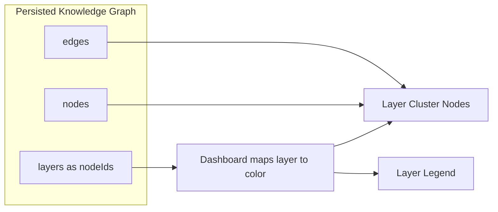

# Q3 README

## Question

Why encode layer information as visual attributes (color) rather than explicit graph nodes?

## Answer

In Understand-Anything, layers are architectural groupings, not first-class code entities. The schema keeps them in a separate `layers` collection where each layer is a named grouping of node IDs. That matters because layer membership is metadata about the graph, not the same kind of object as a file, function, config, service, or document node.

If layers were modeled as ordinary graph nodes, the system would need artificial edges from many file-level nodes to their layer node. Those synthetic hub nodes would distort graph topology, inflate edge counts, and make the visualization harder to read. Real dependency relationships would be mixed with presentation-only structure.

The dashboard instead turns layer information into a visual lens. `LayerLegend.tsx` defines layer colors, `GraphView.tsx` builds overview cluster nodes from `graph.layers`, and `edgeAggregation.ts` derives cross-layer relationships by aggregating real edges between member nodes. This keeps the semantic graph clean while still giving users a strong architectural overview.

There is an important nuance: the UI does create temporary React Flow layer cluster nodes, but those are presentation objects only. They are not persisted as knowledge-graph nodes, which is exactly what preserves the integrity of the underlying data model.

## Diagram



## Code Snippet

```ts
export const LAYER_PALETTE = [
  { bg: "rgba(74, 124, 155, 0.12)", border: "rgba(74, 124, 155, 0.4)", label: "#4a7c9b" },
  { bg: "rgba(90, 158, 111, 0.12)", border: "rgba(90, 158, 111, 0.4)", label: "#5a9e6f" },
  { bg: "rgba(139, 111, 176, 0.12)", border: "rgba(139, 111, 176, 0.4)", label: "#8b6fb0" },
];
```

## Key Repo Evidence

- `docs/plans/2026-03-14-understand-anything-design.md`
- `understand-anything-plugin/packages/dashboard/src/components/LayerLegend.tsx`
- `understand-anything-plugin/packages/dashboard/src/components/GraphView.tsx`
- `understand-anything-plugin/packages/dashboard/src/utils/edgeAggregation.ts`
