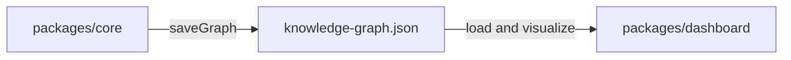

# Q4 README

## Question

Why separate the analysis engine (`core`) from the dashboard (React frontend)?

## Answer

The repo separates `core` from `dashboard` because they solve different problems under different runtime constraints. The analysis engine needs filesystem access, git awareness, parser loading, persistence, fingerprints, and prompt orchestration. The dashboard needs browser-safe graph data, interaction patterns, and rendering performance.

That boundary is explicit in the monorepo. `understand-anything-plugin/packages/core` owns graph construction, schema validation, search, staleness detection, and analyzers. `understand-anything-plugin/packages/dashboard` is a React application that reads the graph and presents it visually. `CLAUDE.md` even warns that the dashboard must only import browser-safe core subpaths like `./types`, `./schema`, and `./search`, because the main core entry point pulls in Node.js modules.

The bridge between the two is the persisted graph artifact, `.understand-anything/knowledge-graph.json`. That artifact lets the graph be generated once in a terminal or agent session and then opened repeatedly in a fast UI. It also allows the same graph to support other features like diff analysis, explain mode, and onboarding.

This separation makes the system more portable as well. Because the core logic is not tightly coupled to one UI host, the project can support multiple agent platforms without rewriting its analysis pipeline.

## Architecture Diagram



## Plain Text Diagram

```text
packages/core
  -> builds and validates the graph
  -> saves knowledge-graph.json

knowledge-graph.json
  -> shared artifact between analysis and UI

packages/dashboard
  -> loads the graph
  -> renders search + graph exploration UI
```

## Code Snippet

```json
"exports": {
  "./search": {
    "types": "./dist/search.d.ts",
    "default": "./dist/search.js"
  },
  "./types": {
    "types": "./dist/types.d.ts",
    "default": "./dist/types.js"
  },
  "./schema": {
    "types": "./dist/schema.d.ts",
    "default": "./dist/schema.js"
  }
}
```

## Key Repo Evidence

- `understand-anything-plugin/packages/core/package.json`
- `understand-anything-plugin/packages/dashboard/package.json`
- `understand-anything-plugin/packages/core/src/persistence/index.ts`
- `docs/plans/2026-03-14-understand-anything-design.md`
- `CLAUDE.md`
