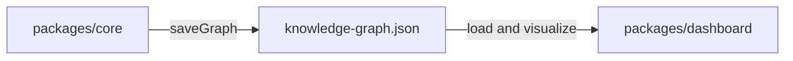

# Q4 — Why separate the analysis engine (`core`) from the dashboard (React frontend)?

<!-- *   **Project Name:** Understand-Anything
*   **Repository:** [https://github.com/Lum1104/Understand-Anything](https://github.com/Lum1104/Understand-Anything)
*   **Project Category:** AI Developer Tools / Code Understanding Platform
*   **Deadline:** April 3rd, 2026 -->

## 1. Project Overview and Key Components

### Repository Analysis Summary

This question examines why Understand-Anything keeps analysis and visualization in separate packages rather than building one tightly coupled application layer. The answer depends on runtime boundaries, packaging constraints, and the repo's choice to persist a reusable graph artifact between generation and consumption.

Within the Understand-Anything codebase, this question primarily touches the following areas:

- `understand-anything-plugin/packages/core/package.json`
- `understand-anything-plugin/packages/dashboard/package.json`
- `understand-anything-plugin/packages/core/src/persistence/index.ts`
- `docs/plans/2026-03-14-understand-anything-design.md`
- `CLAUDE.md`

## 2. Deep Reasoning Questions & Analysis

## Expanded overview

> [!NOTE]
> Understand-Anything has two very different jobs. One job is to inspect repositories, run parsers, use git data, persist graph artifacts, and orchestrate prompts. The other job is to load an already-built graph and give the user a fast, interactive interface for exploring it. The repo separates these jobs because they belong to different environments and have different operational needs.


## Why this matters

> [!IMPORTANT]
> **Key Context**
> - The analysis engine needs Node.js capabilities like filesystem access and persistence.
> - The dashboard needs browser-safe modules and interactive rendering.
> - The graph should be reusable across multiple flows, not bound to one UI session.
> - Multi-platform agent support gets easier when the heavy logic is not welded to one frontend.


## Detailed answer

### Short answer

> [!TIP]
> Understand-Anything separates `core` from `dashboard` because analysis and visualization have different runtime requirements, different responsibilities, and different reuse patterns.


### What belongs in `core`

- parsing and structural extraction
- graph assembly and schema validation
- persistence and path sanitization
- staleness detection and incremental logic
- search/schema/type exports used by other consumers

### What belongs in `dashboard`

- graph rendering with React Flow
- user interaction, search UI, focus modes, and navigation
- layer visualization and visual drill-down
- browser-side state management via Zustand

### Why the JSON bridge matters

The persisted `.understand-anything/knowledge-graph.json` file is the handoff between the two layers. That means the expensive reasoning can happen once in a terminal or agent session, while the dashboard can stay a fast viewer over a durable artifact.

### Why this boundary is explicit in the repo

`CLAUDE.md` warns that the dashboard must import only browser-safe subpath exports like `./search`, `./types`, and `./schema`, not the main core entry point, because the main entry can bring in Node-specific modules. That is strong evidence that the repo intentionally maintains a runtime boundary between analysis logic and frontend logic.

## Architecture Diagram



## Plain Text Diagram

```text
packages/core
  -> builds and validates the graph
  -> saves knowledge-graph.json

knowledge-graph.json
  -> shared artifact between analysis and UI

packages/dashboard
  -> loads the graph
  -> renders search + graph exploration UI
```

## Code Snippet

```json
"exports": {
  "./search": {
    "types": "./dist/search.d.ts",
    "default": "./dist/search.js"
  },
  "./types": {
    "types": "./dist/types.d.ts",
    "default": "./dist/types.js"
  },
  "./schema": {
    "types": "./dist/schema.d.ts",
    "default": "./dist/schema.js"
  }
}
```

### Code citation(s)

| File Referenced | Repository Link |
|---|---|
| `understand-anything-plugin/packages/core/package.json` | [View File](https://github.com/Lum1104/Understand-Anything/blob/main/understand-anything-plugin/packages/core/package.json) |
| `understand-anything-plugin/packages/dashboard/package.json` | [View File](https://github.com/Lum1104/Understand-Anything/blob/main/understand-anything-plugin/packages/dashboard/package.json) |
| `understand-anything-plugin/packages/core/src/persistence/index.ts` | [View File](https://github.com/Lum1104/Understand-Anything/blob/main/understand-anything-plugin/packages/core/src/persistence/index.ts) |
| `docs/plans/2026-03-14-understand-anything-design.md` | [View File](https://github.com/Lum1104/Understand-Anything/blob/main/docs/plans/2026-03-14-understand-anything-design.md) |
| `CLAUDE.md` | [View File](https://github.com/Lum1104/Understand-Anything/blob/main/CLAUDE.md) |


### How the evidence was stitched together

I confirmed this architectural split by comparing the `package.json` configurations of the `core` and `dashboard` workspaces. The presence of Node-specific APIs (like `persistence/index.ts`) in the core, contrasted with the browser-based React Flow implementation in the dashboard, shows a strict boundary. The `CLAUDE.md` exports guidelines further enforce this.

## Practical design implications

| ✨ Design Implication | Description |
|---|---|
| **Impact 1** | The graph can be generated once and reused many times. |
| **Impact 2** | The dashboard stays lightweight and browser-friendly. |
| **Impact 3** | Analysis can run in terminal/agent workflows without needing the UI runtime. |
| **Impact 4** | Other features such as diff analysis and explain mode can consume the same graph artifact. |


## Conclusion

Overall, Q4 highlights a deliberate architectural choice in Understand-Anything: the repository separates graph generation from graph consumption so each side can operate in the environment it is best suited for.

## Architectural reasoning

The `core` package needs local execution powers such as filesystem access, persistence, parsers, and git-aware logic, while the dashboard needs browser-safe modules and interactive rendering. A durable JSON handoff between them keeps both sides simpler and makes the whole system more portable across tools and platforms.

## Trade-offs and limitations

> [!WARNING]
> **Considerations**
> - The project must maintain a clean interface between packages.
> - Some types and utilities need carefully controlled exports.
> - The graph file becomes a contract that must remain valid and well-defined.
> - The payoff is cleaner separation of concerns and much better portability.


## Example scenario

A developer can run `/understand` in a terminal-like agent environment, generate the graph with filesystem and git access, then open the dashboard later and explore that exact graph without rerunning the analysis. That workflow is only clean because the repo separates graph generation from graph rendering.

## Source files referenced

- `understand-anything-plugin/packages/core/package.json`
- `understand-anything-plugin/packages/dashboard/package.json`
- `understand-anything-plugin/packages/core/src/persistence/index.ts`
- `docs/plans/2026-03-14-understand-anything-design.md`
- `CLAUDE.md`

## 3. Findings and Conclusion

The analysis of Q4 shows that the `core`/`dashboard` split is a foundational architecture choice. Understand-Anything treats repository analysis and graph visualization as separate but interoperable systems connected by a durable graph artifact.

In practice, this makes the project more reusable, more portable, and easier to distribute across tools and platforms than a tightly coupled all-in-one frontend/backend design would be.
