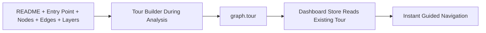

# Q5 README

## Question

Why pre-compute tours during analysis instead of generating them on-demand?

## Answer

Tour generation in this repo is a whole-project reasoning task, not a small UI interaction. In Phase 5 of `understand-anything-plugin/skills/understand/SKILL.md`, the tour builder receives the README, detected entry point, file-level nodes, layers, and full edge set. The prompt template for the tour builder instructs the subagent to compute structural signals like entry points, dependency paths, BFS traversal order, rankings, and clusters before writing the tour.

Because of that, generating tours during analysis makes the dashboard much faster and simpler. When the user opens the graph, the guided learning path already exists in `graph.tour`, so the frontend only needs to render and navigate it. The user does not need to wait for another expensive whole-graph reasoning pass.

Pre-computation also supports offline and low-friction exploration. The dashboard can remain mostly a graph viewer over a durable artifact rather than needing live model access for every tour interaction. That keeps the user experience more reliable and easier to distribute across platforms.

There is also a consistency benefit. A precomputed tour becomes part of the graph snapshot, so the same repository state yields the same onboarding path for everyone until the graph is regenerated.

## Flow Diagram



## Code Snippet

```ts
function getSortedTour(graph: KnowledgeGraph): TourStep[] {
  const tour = graph.tour ?? [];
  return [...tour].sort((a, b) => a.order - b.order);
}
```

## Key Repo Evidence

- `understand-anything-plugin/skills/understand/SKILL.md`
- `understand-anything-plugin/skills/understand/tour-builder-prompt.md`
- `understand-anything-plugin/packages/core/src/analyzer/tour-generator.ts`
- `understand-anything-plugin/packages/dashboard/src/store.ts`
