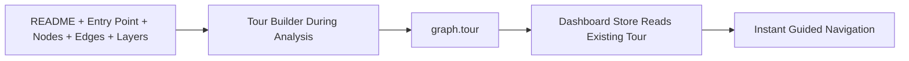

# Q5 — Why pre-compute tours during analysis instead of generating them on-demand?

## 1. Project Overview and Key Components

### Repository Analysis Summary

This question examines why Understand-Anything generates onboarding tours during the analysis pipeline rather than waiting until a user opens the dashboard and asks for a tour. The answer is tied to the repo's view of tours as a graph-level artifact rather than a lightweight UI convenience.

Within the Understand-Anything codebase, this question primarily touches the following areas:

- `understand-anything-plugin/skills/understand/SKILL.md`
- `understand-anything-plugin/skills/understand/tour-builder-prompt.md`
- `understand-anything-plugin/packages/core/src/analyzer/tour-generator.ts`
- `understand-anything-plugin/packages/dashboard/src/store.ts`

## 2. Deep Reasoning Questions & Analysis

## Expanded Overview

The tour system is not just a formatting layer on top of the graph. It requires whole-project reasoning over README context, entry points, graph topology, and layer order. The repository therefore computes tours during analysis, when all of that context is available together, and stores the result as part of the graph snapshot.

## Why This Matters

- Tour quality depends on full graph context, not just one node at a time.
- The dashboard should remain fast and simple when a user opens it.
- Precomputed tours support offline-friendly exploration.
- A stored tour gives a consistent onboarding path for the same repository state.

## Detailed Answer

### Short answer

Understand-Anything pre-computes tours because tour generation is a graph-wide reasoning task, and it is cheaper, faster, and more consistent to do that once during analysis than repeatedly on demand in the dashboard.

### What the tour builder actually uses

- README summary and project framing
- detected entry point
- file-level nodes
- layer metadata
- full edge structure

### Why not generate tours on demand?

If the dashboard generated tours on demand, it would either need direct model access or a callback into an analysis runtime. That would add latency, complexity, and operational dependencies to a UI that is currently designed to consume an already-built artifact.

### What the repo stores instead

The tour is persisted as `graph.tour`, and the dashboard store simply reads and sorts those steps for immediate guided navigation.

## Flow Diagram



## Code Snippet

```ts
function getSortedTour(graph: KnowledgeGraph): TourStep[] {
  const tour = graph.tour ?? [];
  return [...tour].sort((a, b) => a.order - b.order);
}
```

## Practical Design Implications

- Dashboard load stays lightweight.
- Guided onboarding is available immediately after analysis.
- The same graph snapshot yields the same tour for all viewers.
- The project can support browsing even when live model access is unavailable.

## Conclusion

Overall, Q5 highlights a deliberate architectural choice in Understand-Anything: tours are treated as part of the analyzed project artifact, not as a transient UI feature generated on demand.

## Architectural Reasoning

Tour quality depends on project-wide context such as entry points, README framing, layer order, and graph topology. Since that context is already assembled during analysis, generating tours at that stage is cheaper and more coherent than forcing the dashboard to reconstruct the same reasoning later.

## Trade-offs and Limitations

- Tour regeneration requires rerunning analysis when the project changes materially.
- Tour quality depends on the analysis-time context and prompt output.
- Storing tours adds another artifact field to validate.
- The benefit is much lower runtime friction for the dashboard.

## Example Scenario

A new teammate opens the dashboard for the first time. Because the tour was already computed during analysis, they can immediately step through the repository's architecture instead of waiting for the system to re-run graph-wide reasoning in the browser.

## Source Files Referenced

- `understand-anything-plugin/skills/understand/SKILL.md`
- `understand-anything-plugin/skills/understand/tour-builder-prompt.md`
- `understand-anything-plugin/packages/core/src/analyzer/tour-generator.ts`
- `understand-anything-plugin/packages/dashboard/src/store.ts`

## 3. Findings and Conclusion

The analysis of Q5 shows that tours are treated as a first-class graph artifact, not just a UI feature. Understand-Anything computes them upstream because they depend on whole-project reasoning and because the dashboard is intentionally designed as a consumer of durable graph data.

In practical terms, this makes the onboarding experience faster, more repeatable, and less dependent on live runtime conditions.
