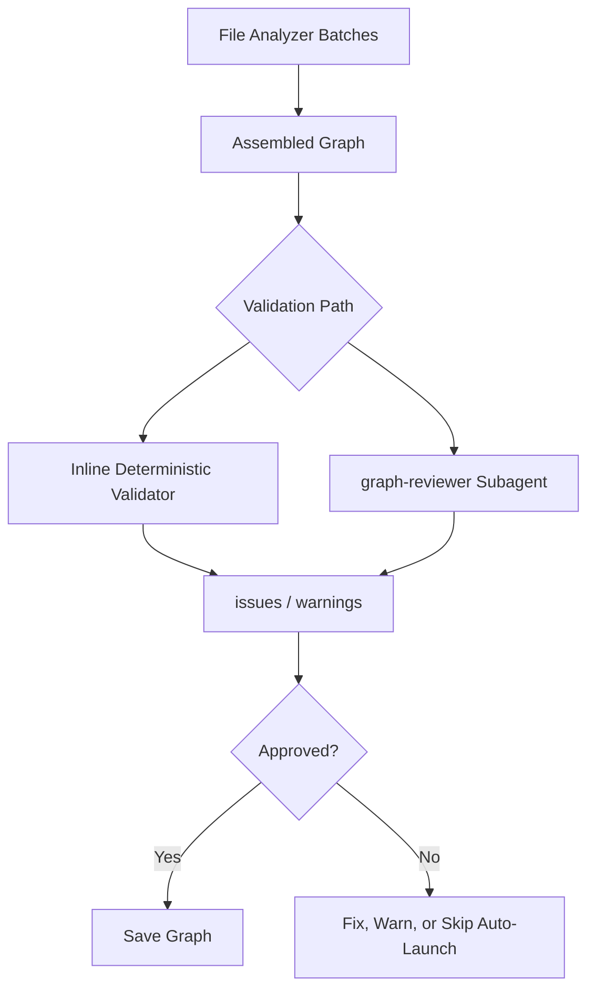

# Q6 — Why implement `graph-reviewer` as a separate validation agent?

## 1. Project Overview and Key Components

### Repository Analysis Summary

This question examines why Understand-Anything treats graph validation as a separate responsibility rather than folding it into file analysis or graph assembly. The answer depends on the repo's separation between generation and quality control.

Within the Understand-Anything codebase, this question primarily touches the following areas:

- `understand-anything-plugin/skills/understand/SKILL.md`
- `understand-anything-plugin/skills/understand/graph-reviewer-prompt.md`
- `understand-anything-plugin/packages/core/src/schema.ts`

## 2. Deep Reasoning Questions & Analysis

## Expanded Overview

The multi-agent pipeline produces a graph through several stages, and the file analyzers work in isolated batches. That creates the possibility of local correctness but global inconsistency. A separate graph reviewer exists to evaluate the assembled graph as a whole and to protect downstream consumers from malformed graph data.

## Why This Matters

- File-analysis batches may not have complete global context.
- Broken references, duplicates, or missing coverage can survive local extraction.
- The dashboard assumes the graph artifact is structurally valid.
- Validation should be skeptical and independent from generation.

## Detailed Answer

### Short answer

Understand-Anything implements `graph-reviewer` as a separate validation agent because generation and validation are different jobs, and the graph needs a final whole-project QA pass before it becomes the persisted artifact.

### Why file analyzers should not be the final validators

File analyzers are optimized for extracting useful information from batches of files. They are not in the best position to guarantee global uniqueness, full layer coverage, or graph-wide referential integrity.

### What the reviewer checks

- schema validity
- dangling references
- duplicate node IDs
- layer coverage for file-level nodes
- tour references and tour structure
- graph completeness and warnings

### Cost-aware design in the repo

The repo uses a two-level validation strategy:

- default inline deterministic validation for the common case
- optional `--review` path with a stronger LLM graph reviewer

That structure shows the project is optimizing for both performance and assurance.

## Validation Flow



## Code Snippet

```bash
node $PROJECT_ROOT/.understand-anything/tmp/ua-graph-validate.js \
  "<graph-file-path>" \
  "$PROJECT_ROOT/.understand-anything/tmp/ua-review-results.json"
```

## Practical Design Implications

- The persisted graph is more trustworthy.
- Downstream UI and search behavior are less likely to break on malformed data.
- The pipeline gains a clear QA boundary before persistence.
- Problems can be auto-fixed or surfaced explicitly instead of silently propagating.

## Conclusion

Overall, Q6 highlights a deliberate architectural choice in Understand-Anything: validation is independent from generation so the final graph can be checked skeptically before becoming the system’s shared artifact.

## Architectural Reasoning

The file analyzers are optimized for extraction, not for whole-graph QA. A separate reviewer phase creates a clean boundary where global invariants such as referential integrity, layer coverage, and tour consistency can be enforced after the graph is assembled. That separation increases trust in every downstream feature that consumes the graph.

## Trade-offs and Limitations

- Validation adds another phase and more orchestration.
- Full review mode costs more than basic deterministic checks.
- Some issues still require heuristic fixes or warnings instead of perfect repair.
- The benefit is a much safer graph artifact contract.

## Example Scenario

Suppose one file-analysis batch emits an edge pointing to a node ID that another batch never produced. Without a final reviewer, that broken reference could reach the dashboard and cause incorrect navigation or rendering problems. The graph reviewer catches that issue before the graph is treated as authoritative.

## Source Files Referenced

- `understand-anything-plugin/skills/understand/SKILL.md`
- `understand-anything-plugin/skills/understand/graph-reviewer-prompt.md`
- `understand-anything-plugin/packages/core/src/schema.ts`

## 3. Findings and Conclusion

The analysis of Q6 shows that `graph-reviewer` is a deliberate architectural quality gate. Understand-Anything does not assume that graph generation is self-validating; it inserts a separate review layer so the final artifact can be trusted by the dashboard and other consumers.

In practice, this makes the system more robust, easier to debug, and safer to use as a durable code-understanding platform.
