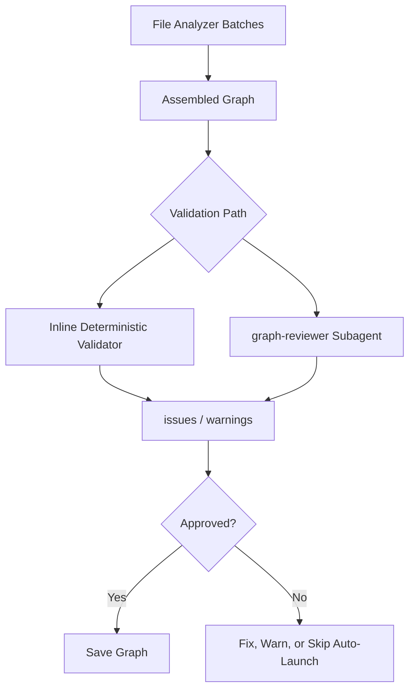

# Q6 README

## Question

Why implement `graph-reviewer` as a separate validation agent?

## Answer

The project treats graph generation and graph validation as different jobs. File analyzers are optimized for coverage and throughput across many batches. The graph reviewer is optimized for skepticism, completeness, and referential integrity after the full graph has been assembled.

This separation matters because the pipeline is distributed. File analyzers run in isolated batches and may not have full global context, which creates a risk of dangling references, duplicate IDs, missing coverage, or inconsistent layer assignments. The reviewer gets the assembled graph and, in full review mode, cross-checks it against the Phase 1 scan inventory.

The repo also uses a cost-aware validation strategy. By default it runs an inline deterministic validator that checks node arrays, edge references, layer coverage, and tour references. When stronger assurance is needed, the `--review` path dispatches a dedicated LLM reviewer. That layered approach catches both straightforward structural problems and higher-level quality issues.

Most importantly, the reviewer protects downstream consumers. The dashboard and other graph-dependent features assume the persisted graph is coherent. A separate reviewer acts as the final quality gate before that graph becomes the authoritative project artifact.

## Validation Flow



## Code Snippet

```bash
node $PROJECT_ROOT/.understand-anything/tmp/ua-graph-validate.js \
  "<graph-file-path>" \
  "$PROJECT_ROOT/.understand-anything/tmp/ua-review-results.json"
```

## Key Repo Evidence

- `understand-anything-plugin/skills/understand/SKILL.md`
- `understand-anything-plugin/skills/understand/graph-reviewer-prompt.md`
- `understand-anything-plugin/packages/core/src/schema.ts`
