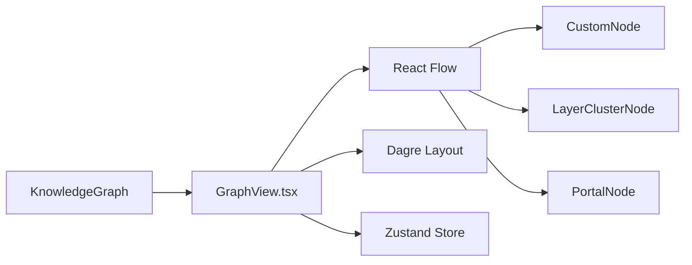

# Q7 README

## Question

Why use React Flow instead of custom Canvas implementation?

## Answer

The dashboard is a React application that needs rich node-based interaction: custom nodes, panning, zooming, minimap support, controls, fit-view behavior, selection state, layer drill-down, and graph overlays. React Flow is a natural fit because it is specifically designed for interactive node-graph interfaces inside React.

The repo already depends on React Flow deeply. `GraphView.tsx` uses `ReactFlowProvider`, custom node types, built-in background and controls, selected-node focus, and tour-fit behavior. The dashboard also combines React Flow with Dagre layout and custom components such as `LayerClusterNode` and `PortalNode`.

Building the same experience with a custom Canvas renderer would mean recreating viewport math, hit-testing, drag behavior, edge rendering, selection logic, and React-friendly component composition from scratch. That would add a large maintenance burden while contributing little to the actual product differentiator, which is codebase understanding.

The design docs explicitly describe React Flow as a better fit than raw D3 for this use case. It gives the team a mature graph interaction layer so they can spend effort on search, tours, personas, and architecture understanding instead of low-level graphics plumbing.

## Component Diagram



## Code Snippet

```ts
const nodeTypes = {
  custom: CustomNode,
  "layer-cluster": LayerClusterNode,
  portal: PortalNode,
};
```

## Key Repo Evidence

- `understand-anything-plugin/packages/dashboard/src/components/GraphView.tsx`
- `understand-anything-plugin/packages/dashboard/package.json`
- `docs/plans/2026-03-14-understand-anything-design.md`
- `README.md`
