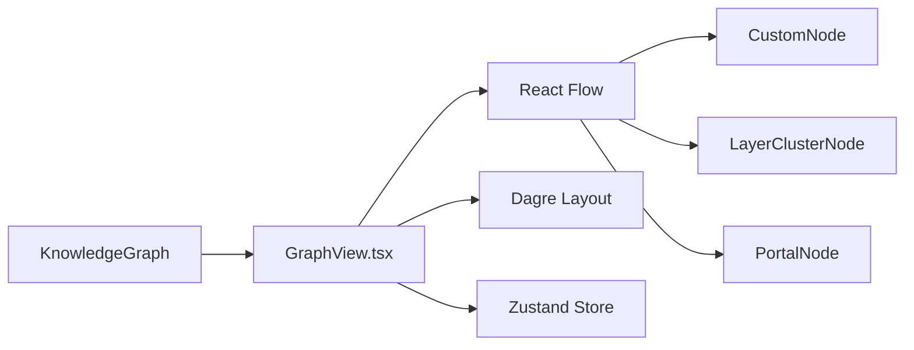

# Q7 — Why use React Flow instead of custom Canvas implementation?

## 1. Project Overview and Key Components

### Repository Analysis Summary

This question examines why Understand-Anything chose React Flow as the graph interaction layer instead of building a custom Canvas-based visualization stack. The answer depends on the dashboard's interaction model and the repo's desire to invest engineering effort in code understanding rather than low-level graphics plumbing.

Within the Understand-Anything codebase, this question primarily touches the following areas:

- `understand-anything-plugin/packages/dashboard/src/components/GraphView.tsx`
- `understand-anything-plugin/packages/dashboard/package.json`
- `docs/plans/2026-03-14-understand-anything-design.md`
- `README.md`

## 2. Deep Reasoning Questions & Analysis

## Expanded Overview

The dashboard is not a static diagram renderer. It needs node selection, panning, zooming, minimap support, fit-view logic, cluster nodes, portal nodes, search focusing, tour highlighting, and integration with React state. React Flow already provides a strong foundation for that interaction model, while a custom Canvas solution would require much more infrastructure work.

## Why This Matters

- The dashboard is deeply integrated with React and Zustand.
- The graph UI needs mature interaction patterns, not just drawing primitives.
- The team benefits more from building code-understanding features than from reinventing node-editor infrastructure.
- Layout and custom node composition are already central to the dashboard architecture.

## Detailed Answer

### Short answer

Understand-Anything uses React Flow because it is purpose-built for interactive node graphs in React, while a custom Canvas implementation would require rebuilding a large amount of interaction and rendering behavior from scratch.

### What the dashboard needs

- custom node types
- panning and zooming
- minimap and controls
- fit-view behavior
- graph overlays and navigation
- integration with React components and store-driven state

### What React Flow gives the repo

- a React-native graph interaction layer
- support for custom node components
- built-in viewport and controls
- a natural fit with the existing React + Vite + Zustand stack

### Why not custom Canvas?

Canvas would provide lower-level drawing flexibility, but the team would have to build hit-testing, drag logic, selection state, viewport transforms, and component composition themselves. That would consume engineering time that the repo is clearly trying to spend on architecture, tours, search, and explainability.

## Component Diagram



## Code Snippet

```ts
const nodeTypes = {
  custom: CustomNode,
  "layer-cluster": LayerClusterNode,
  portal: PortalNode,
};
```

## Practical Design Implications

- The dashboard can ship advanced graph interactions faster.
- Custom graph semantics can be layered on top of a mature UI foundation.
- The React codebase stays aligned with the rest of the frontend stack.
- The project can focus effort on code understanding instead of raw visualization infrastructure.

## Conclusion

Overall, Q7 highlights a deliberate architectural choice in Understand-Anything: the team relies on an existing graph interaction framework so it can invest engineering effort in code comprehension features instead of rebuilding generic graph UI mechanics.

## Architectural Reasoning

React Flow matches the repo’s actual needs: React-native components, viewport control, node interaction, and integration with store-driven state. A custom Canvas solution would push the project toward low-level rendering work that does not differentiate the product. The chosen library lets the architecture stay focused on semantics, not plumbing.

## Trade-offs and Limitations

- The dashboard inherits library-specific constraints and patterns.
- Very custom visual behavior may still need workarounds around the library.
- React Flow adds dependency weight compared to a minimal renderer.
- The trade-off is worth it for speed of implementation and maintainability.

## Example Scenario

When a user clicks a node from search or a tour step, the dashboard needs to fit the viewport to those nodes, keep custom node rendering intact, and preserve React-driven state transitions. React Flow makes that workflow straightforward. A custom Canvas engine would require significantly more bespoke infrastructure to support the same interaction quality.

## Source Files Referenced

- `understand-anything-plugin/packages/dashboard/src/components/GraphView.tsx`
- `understand-anything-plugin/packages/dashboard/package.json`
- `docs/plans/2026-03-14-understand-anything-design.md`
- `README.md`

## 3. Findings and Conclusion

The analysis of Q7 shows that React Flow is a pragmatic architecture choice aligned with the dashboard's real requirements. Understand-Anything needs a graph interaction system that works naturally with React, custom components, and state-driven behavior, and React Flow satisfies that far better than a raw Canvas implementation would for this project.

In practical terms, this lets the repo focus its engineering effort on code intelligence and user comprehension rather than on rebuilding generic graph UI mechanics.
