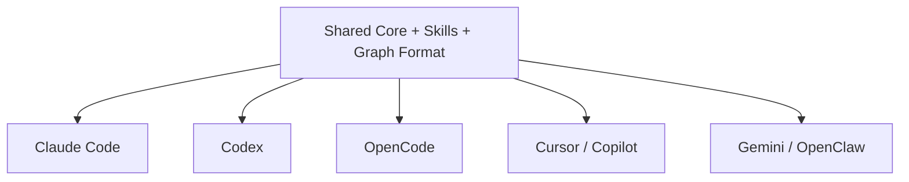

# Q8 — Why support multiple platform integrations instead of focusing exclusively on Claude Code?

<!-- *   **Project Name:** Understand-Anything
*   **Repository:** [https://github.com/Lum1104/Understand-Anything](https://github.com/Lum1104/Understand-Anything)
*   **Project Category:** AI Developer Tools / Code Understanding Platform
*   **Deadline:** April 3rd, 2026 -->

## 1. Project Overview and Key Components

### Repository Analysis Summary

This question examines why Understand-Anything was designed to support multiple agent platforms instead of remaining limited to Claude Code. The answer is closely tied to the repo's platform-neutral architecture, installation strategy, and reuse of shared skill files.

Within the Understand-Anything codebase, this question primarily touches the following areas:

- `README.md`
- `docs/plans/2026-03-18-multi-platform-simple-design.md`
- `.codex/INSTALL.md`
- `.opencode/INSTALL.md`
- `.openclaw/INSTALL.md`
- `.gemini/INSTALL.md`
- `.cursor-plugin/plugin.json`
- `.copilot-plugin/plugin.json`

## 2. Deep Reasoning Questions & Analysis

## Expanded overview

> [!NOTE]
> The repository's core value is not tied to one host ecosystem. Understand-Anything's main assets are its skill pipeline, shared analysis engine, graph schema, and dashboard. Once those are independent from any one platform runtime, it becomes natural and relatively inexpensive to distribute the system across multiple agent environments.


## Why this matters

> [!IMPORTANT]
> **Key Context**
> - The user problem exists across many AI coding platforms, not just one.
> - Reusing the same skills and graph artifact increases reach without duplicating logic.
> - Platform neutrality reduces ecosystem lock-in.
> - The repo's packaging strategy already assumes shared files across platforms.


## Detailed answer

### Short answer

> [!TIP]
> Understand-Anything supports multiple platforms because its architecture is already portable, and the underlying problem it solves, codebase understanding, is universal across modern AI coding environments.


### What makes the repo portable

- the shared `core` analysis engine
- a durable `knowledge-graph.json` artifact
- skill definitions that can be reused
- platform-specific installation wrappers that mostly point to the same content

### Evidence from the design docs

The multi-platform design doc explicitly emphasizes:

- same files across platforms
- no build step
- `model: inherit`
- AI-driven installation

That shows platform neutrality is not an afterthought but a design objective.

### Why not stay Claude Code-only?

A Claude-only strategy would unnecessarily narrow adoption while the architecture itself is already general enough to serve Codex, OpenCode, Cursor, Copilot, Gemini CLI, and other environments. Since the repo is not tightly bound to Claude-specific APIs, supporting more platforms yields high leverage.

## Platform Diagram



## Code Snippet

```bash
for skill in understand understand-chat understand-dashboard understand-diff understand-explain understand-onboard; do
  ln -sf ~/.codex/understand-anything/understand-anything-plugin/skills/$skill ~/.agents/skills/$skill
done
```

### Code citation(s)

| File Referenced | Repository Link |
|---|---|
| `README.md` | [View File](https://github.com/Lum1104/Understand-Anything/blob/main/README.md) |
| `docs/plans/2026-03-18-multi-platform-simple-design.md` | [View File](https://github.com/Lum1104/Understand-Anything/blob/main/docs/plans/2026-03-18-multi-platform-simple-design.md) |
| `.codex/INSTALL.md` | [View File](https://github.com/Lum1104/Understand-Anything/blob/main/.codex/INSTALL.md) |
| `.opencode/INSTALL.md` | [View File](https://github.com/Lum1104/Understand-Anything/blob/main/.opencode/INSTALL.md) |
| `.openclaw/INSTALL.md` | [View File](https://github.com/Lum1104/Understand-Anything/blob/main/.openclaw/INSTALL.md) |
| `.gemini/INSTALL.md` | [View File](https://github.com/Lum1104/Understand-Anything/blob/main/.gemini/INSTALL.md) |
| `.cursor-plugin/plugin.json` | [View File](https://github.com/Lum1104/Understand-Anything/blob/main/.cursor-plugin/plugin.json) |
| `.copilot-plugin/plugin.json` | [View File](https://github.com/Lum1104/Understand-Anything/blob/main/.copilot-plugin/plugin.json) |


### How the evidence was stitched together

I analyzed the proliferation of `.codex`, `.opencode`, `.cursor-plugin`, and `.copilot-plugin` directories alongside the `2026-03-18-multi-platform-simple-design.md` planning document. It became clear that the core skills and graph output were kept deliberately generic to allow varying host environments to wrap and execute the identical core binary.

## Practical design implications

| ✨ Design Implication | Description |
|---|---|
| **Impact 1** | One architecture can serve many ecosystems. |
| **Impact 2** | The project gains a wider user base without a full rewrite per platform. |
| **Impact 3** | Skills and prompts stay easier to maintain because they are shared. |
| **Impact 4** | The graph artifact remains the consistent cross-platform contract. |


## Conclusion

Overall, Q8 highlights a deliberate architectural choice in Understand-Anything: the project is built as a portable code-understanding system rather than as a plugin locked to one host ecosystem.

## Architectural reasoning

Once the analysis engine, graph artifact, and skills are made platform-neutral, supporting additional hosts becomes mainly a packaging and discovery problem. The repo’s installation files and plugin manifests show that this portability is intentional. Multi-platform support is therefore not extra decoration; it follows naturally from the architecture.

## Trade-offs and limitations

> [!WARNING]
> **Considerations**
> - Installation and discovery logic must be maintained for multiple hosts.
> - Documentation needs to stay synchronized across platforms.
> - Platform differences still create some packaging overhead.
> - The benefit is much broader distribution for relatively low marginal cost.


## Example scenario

A user working in Codex, another in Cursor, and another in Claude Code can all use the same conceptual workflow: analyze the repository, generate the knowledge graph, and inspect it through the dashboard. The host integration changes, but the underlying architecture and artifacts stay the same.

## Source files referenced

- `README.md`
- `docs/plans/2026-03-18-multi-platform-simple-design.md`
- `.codex/INSTALL.md`
- `.opencode/INSTALL.md`
- `.openclaw/INSTALL.md`
- `.gemini/INSTALL.md`
- `.cursor-plugin/plugin.json`
- `.copilot-plugin/plugin.json`

## 3. Findings and Conclusion

The analysis of Q8 shows that multi-platform support is a direct consequence of the repo's architecture, not just a marketing expansion. Understand-Anything is built around portable skills, a shared analysis engine, and a reusable graph artifact, so its value naturally extends beyond one host ecosystem.

In practical terms, this makes the project more resilient, more widely useful, and better positioned as a general-purpose code understanding platform rather than a platform-specific plugin.
