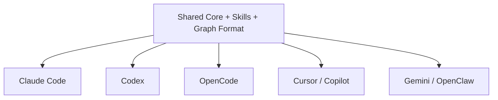

# Q8 README

## Question

Why support multiple platform integrations instead of focusing exclusively on Claude Code?

## Answer

The README and platform files show that Understand-Anything has already grown beyond a Claude Code-only tool. It now supports Claude Code, Codex, OpenCode, OpenClaw, Cursor, VS Code with GitHub Copilot, Gemini CLI, and more. That is possible because the architecture is platform-neutral at its core.

The real value of the project is not a single platform integration. It is the shared analysis engine, the multi-agent skill pipeline, and the persisted knowledge-graph artifact. Once those are portable, adding another platform becomes relatively cheap. The install files in `.codex`, `.opencode`, `.openclaw`, and `.gemini` mostly connect the same skills to different discovery mechanisms, while Cursor and Copilot manifests point to the same skill and agent directories.

The multi-platform design docs reinforce this philosophy with principles like "same files, all platforms," `model: inherit`, and AI-driven installation. That means the project is built to reuse the same prompts, skills, and structure across ecosystems instead of maintaining separate forks.

From a product perspective, this is also rational. The user problem, understanding large unfamiliar codebases, exists across all modern AI coding environments. By staying platform-neutral, the project reduces ecosystem lock-in and increases reach without duplicating its core implementation.

## Platform Diagram



## Code Snippet

```bash
for skill in understand understand-chat understand-dashboard understand-diff understand-explain understand-onboard; do
  ln -sf ~/.codex/understand-anything/understand-anything-plugin/skills/$skill ~/.agents/skills/$skill
done
```

## Key Repo Evidence

- `README.md`
- `docs/plans/2026-03-18-multi-platform-simple-design.md`
- `.codex/INSTALL.md`
- `.opencode/INSTALL.md`
- `.openclaw/INSTALL.md`
- `.gemini/INSTALL.md`
- `.cursor-plugin/plugin.json`
- `.copilot-plugin/plugin.json`
