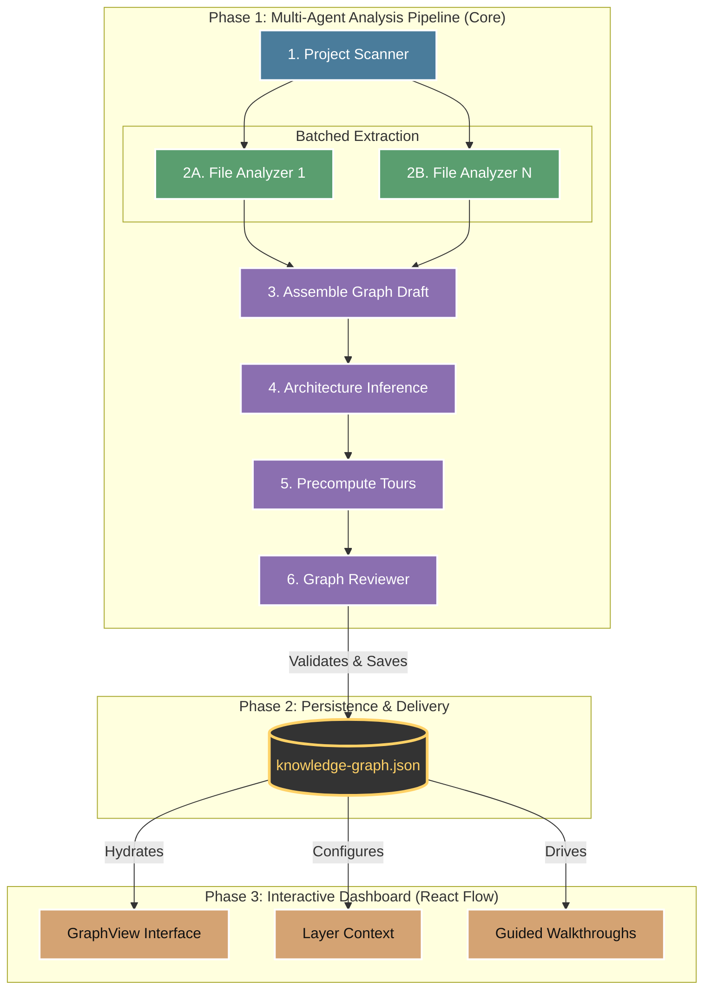

# Project 4 Reverse Engineering Report: Understand-Anything

* **Project Name:** Understand-Anything
* **Repository:** [https://github.com/Lum1104/Understand-Anything](https://github.com/Lum1104/Understand-Anything)
* **Project Category:** AI Developer Tools / Code Understanding Platform
* **Deadline:** April 3, 2026

## 1. Project Overview and Key Components

### Repository Analysis Summary

> [!NOTE]
> **Quick Summary:**

Understand-Anything is an open-source system for turning a source repository into an interactive knowledge graph. Instead of only answering isolated questions about code, it analyzes the project, extracts structural and semantic relationships, identifies architectural layers, generates guided learning tours, and renders the result in a dashboard that supports exploration, search, and onboarding.

From a reverse-engineering perspective, the repository is built around a clear separation between **analysis**, **persistence**, and **visualization**. The analysis pipeline is driven through a staged skill workflow inside `understand-anything-plugin/skills/understand/SKILL.md`. That workflow scans the project, analyzes files in batches, assembles nodes and edges, detects layers, builds tours, validates the graph, and persists the result to `.understand-anything/knowledge-graph.json`.

At a high level, the system can be understood as a bridge between raw source code and a reusable architectural artifact. The repo combines LLM reasoning, tree-sitter-based structural extraction, graph schema validation, and a React Flow dashboard so that the final output is not just a summary, but a navigable model of the codebase.

### Key Components and Important Files

The following areas are especially important for understanding the internal architecture of Understand-Anything:

| File Component | Architectural Significance |
|---|---|
| `understand-anything-plugin/skills/understand/SKILL.md` | The core orchestration file. It defines the full `/understand` pipeline, including scan, batch analysis, architecture inference, tour generation, review, save, and incremental update logic. |
| `understand-anything-plugin/packages/core/src/plugins/tree-sitter-plugin.ts` | Implements the structural-analysis plugin using `web-tree-sitter`. This file is central to understanding how the project supports multi-language parsing in a shared TypeScript core. |
| `understand-anything-plugin/packages/core/src/analyzer/layer-detector.ts` | Handles layer detection. This matters because the dashboard and tours depend on architectural grouping, not just flat file/function extraction. |
| `understand-anything-plugin/packages/core/src/analyzer/tour-generator.ts` | Contains tour-generation logic and the fallback heuristic tour builder. This shows how the project turns a graph into a guided onboarding path. |
| `understand-anything-plugin/packages/core/src/schema.ts` | Defines graph validation, normalization, and repair behavior. This file is key to understanding why the dashboard can rely on the persisted graph artifact. |
| `understand-anything-plugin/packages/core/src/persistence/index.ts` | Implements graph persistence and path sanitization. It reveals how the analysis engine writes a reusable graph artifact to disk while protecting local path details. |
| `understand-anything-plugin/packages/dashboard/src/components/GraphView.tsx` | The main graph-view implementation. This file shows how the dashboard turns graph data into a React Flow experience with clustering, layering, navigation, and focus modes. |
| `understand-anything-plugin/packages/dashboard/src/components/LayerLegend.tsx` | Encodes the visual language for architectural layers, helping explain why layer information is represented as a dashboard lens rather than a core graph node type. |

### Architectural Interpretation

#### High-Level Pipeline Architecture

Taken together, these components show that Understand-Anything is not just a visualization app and not just a prompt pack. It is better understood as a **pipeline-based code intelligence system**. The repository repeatedly reinforces the same design priorities:

| Chosen Approach | Rejected Approach |
|---|---|
| **Staged reasoning** | Monolithic prompting |
| **Durable graph artifacts** | Ephemeral chat-only output |
| **Language-agnostic structure extraction** | Single-language specialization |
| **Architectural grouping as a visualization lens** | Fake dependency topology |
| **Offline-friendly onboarding through precomputed tours** | - |
| **Validation as a separate quality gate** | - |
| **Platform-neutral packaging and distribution** | - |

> [!IMPORTANT]
> **Key Takeaway:** The most important architectural observation is that the repo treats **understanding itself as a persistent product artifact**. The graph is meant to outlive the individual model turn that generated it. This makes the system reusable across dashboards, explain flows, diff analysis, onboarding, and multi-platform agent usage.

## 2. Deep Reasoning Questions & Analysis

The following 8 linked Markdown files contain the detailed reverse-engineering analysis of major Understand-Anything design choices:

| # | Deep Reasoning Question | Link |
|---|---|---|
| **Q1** | Why use five sequential agents instead of a single monolithic agent? | [Read Analysis](./Q1/README.md) |
| **Q2** | Why use tree-sitter instead of language-specific AST parsers like Python's `ast` module? | [Read Analysis](./Q2/README.md) |
| **Q3** | Why encode layer information as visual attributes (color) rather than explicit graph nodes? | [Read Analysis](./Q3/README.md) |
| **Q4** | Why separate the analysis engine (`core`) from the dashboard (React frontend)? | [Read Analysis](./Q4/README.md) |
| **Q5** | Why pre-compute tours during analysis instead of generating them on-demand? | [Read Analysis](./Q5/README.md) |
| **Q6** | Why implement `graph-reviewer` as a separate validation agent? | [Read Analysis](./Q6/README.md) |
| **Q7** | Why use React Flow instead of custom Canvas implementation? | [Read Analysis](./Q7/README.md) |
| **Q8** | Why support multiple platform integrations instead of focusing exclusively on Claude Code? | [Read Analysis](./Q8/README.md) |

### What These Questions Cover

Collectively, these 8 questions are designed to reveal the deeper reasoning behind the repository's architecture rather than just listing files or technologies. They focus on:

- how the multi-agent pipeline is staged and why that matters
- how structural analysis is implemented in a portable way
- how architecture is represented without polluting graph semantics
- how the analysis engine and dashboard are separated cleanly
- how onboarding is encoded as a precomputed artifact
- how graph validation is treated as an independent concern
- how the graph UI is built around React-native interaction patterns
- how the project keeps its packaging and distribution platform-neutral

Each linked question file includes:

- the core question
- a detailed answer
- a diagram or flowchart
- a short repo-grounded snippet
- key source files for evidence

### Why These Questions Matter

These questions matter because the value of Understand-Anything comes from the interaction of several architectural decisions rather than one isolated feature. The repository becomes useful as a code understanding system because:

- staged analysis keeps reasoning focused while still allowing parallel throughput
- tree-sitter enriches the graph without making the system brittle or language-locked
- layers improve readability without corrupting the graph's real semantics
- the persisted graph separates expensive analysis from fast visualization
- precomputed tours transform a graph into an onboarding artifact
- validation prevents weak graph data from breaking downstream UX
- React Flow lets the project invest effort in semantics rather than low-level rendering
- multi-platform support extends the tool's reach without forking its core logic

In other words, these deep reasoning questions explain *why Understand-Anything works as a reusable code understanding system rather than merely what technologies it uses*.

## 3. Findings and Conclusion

> [!SUMMARY]
> The reverse-engineering analysis shows that Understand-Anything is built around a coherent architecture for durable codebase understanding rather than ad hoc prompt orchestration. Across the repository and across the eight design questions, the same philosophy appears repeatedly: meaningful understanding should be extracted once, validated, stored, and reused.

> [!TIP]
> **Finding 1:** **the graph artifact is the real center of gravity of the system**. The multi-agent pipeline, schema layer, persistence logic, and dashboard all orbit around the idea that code understanding should become a durable model rather than a temporary chat response.

> [!TIP]
> **Finding 2:** **the project separates concerns aggressively and productively**. File scanning, file analysis, architecture inference, tour generation, validation, persistence, and visualization are related, but they are not collapsed into one monolithic unit. This improves scaling, reliability, and reuse.

> [!TIP]
> **Finding 3:** **the repository is designed for portability**. This shows up in the choice of `web-tree-sitter`, the JSON bridge between analysis and UI, browser-safe subpath exports, and the multi-platform installation model. The system is structured so it can move across agent ecosystems with relatively low marginal effort.

> [!TIP]
> **Finding 4:** **the repo treats onboarding and explainability as first-class outputs**, not afterthoughts. Guided tours, layer grouping, summaries, and dashboard affordances all suggest that the system is optimized not just for extraction, but for human comprehension.

> [!TIP]
> **Finding 5:** **validation is central to trustworthiness**. The graph reviewer, schema sanitization, and repair logic all point to a system that understands malformed graph data is dangerous. The repo therefore puts a quality gate between analysis output and user-facing consumption.

Overall, Understand-Anything can be understood as a graph-centered code intelligence platform that integrates staged analysis, structural parsing, architecture inference, persistence, validation, and visualization into a single coherent workflow. The linked eight-question analyses provide the detailed evidence for the design decisions that make that workflow work.
